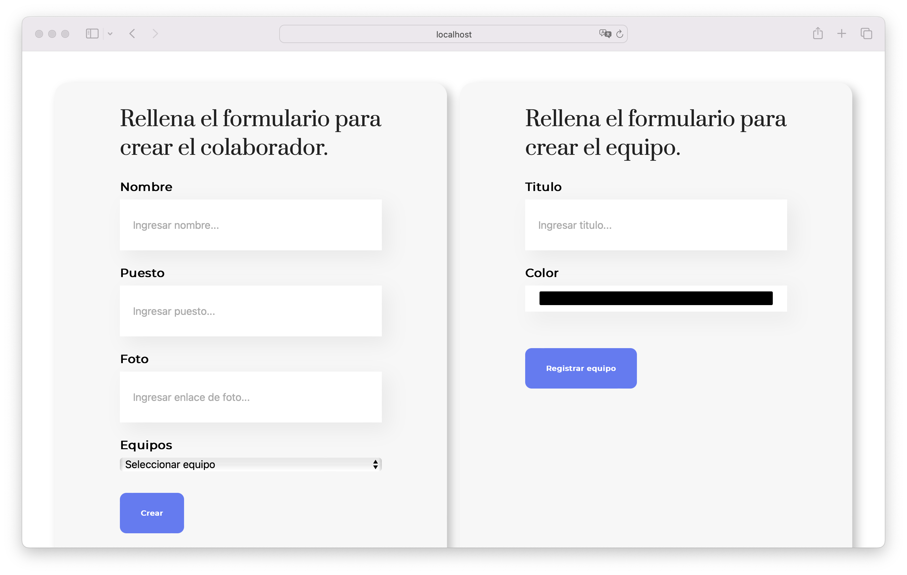

# Team Organizer

This project is an application designed to efficiently organize teams within an organization. It provides a user-friendly interface to create, read, update, and delete (CRUD) collaborators and teams, making it easy to manage and visualize team structures and individual roles. The application supports adding new teams, assigning collaborators to specific teams, and provides a visually appealing way to display team information. Ideal for managing and segmenting teams in organizational settings.

## Key Features

- **CRUD Operations**: Perform Create, Read, Update, and Delete operations for both collaborators and teams.
- **Create Collaborators**: Easily add new collaborators through a straightforward form.
- **Assign to Teams**: Assign collaborators to specific teams and create new teams as needed.
- **Visual Team Display**: View teams and their collaborators with distinct colors for easy segmentation.
- **Collaborator Cards**: Display collaborators in cards with a photo, name, and position.
- **Like Feature**: Give _likes_ to collaborators to highlight preferences.
- **Delete Collaborators**: Remove collaborators from the system when necessary.

**Team Organizer** is ideal for team managers, HR departments, and organizational leaders looking to streamline team management and visualization.

## Screenshots





## Tech Stack

**Client:** HTML, CSS, JavaScript, React, NPM

## Prerequisites

Before you begin, ensure you have the following installed:

- **Node.js**: Team Organizer requires Node.js to run. You can download it from [nodejs.org](https://nodejs.org/).
- **Visual Studio Code (optional)**: You can download it from [Visual Studio Code](https://code.visualstudio.com/).

## Installation Steps

### Download the project:

1. Download the project from the repository or directly as a ZIP file.

### Clone the repository (alternative):

1. Clone the repository to your local machine:

   ```bash
   git clone https://github.com/jorgedoiany/team-organizer.git

   ```

2. Navigate into the project directory:

   ```bash
   cd team-organizer
   ```

### Install dependencies:

1. Install the necessary dependencies using npm:

   ```bash
   npm install
   ```

## Running the Application

### Start the development server:

1. To start Team Organizer in development mode, run:

   ```bash
   npm start

   ```

2. Open your browser and navigate to http://localhost:3000 to view ChronoTimer.

### Build for production:

1. To build Team Organizer for production, use:

   ```bash
   npm run build
   ```

This command bundles the app into static files for deployment.

## Additional Notes

- Make sure you have Node.js installed globally on your machine.
- If you prefer, you can use Visual Studio Code for editing the codebase.
- You can also download the project directly as a ZIP file from the repository.
- This project uses npm to manage dependencies and run scripts.
- For more information on React, visit [reactjs.org](https://react.dev/).

That's it! You should now be able to see and use the **Team Organizer** app in your browser.

## Author

- [@jorgedoiany](https://github.com/jorgedoiany)
